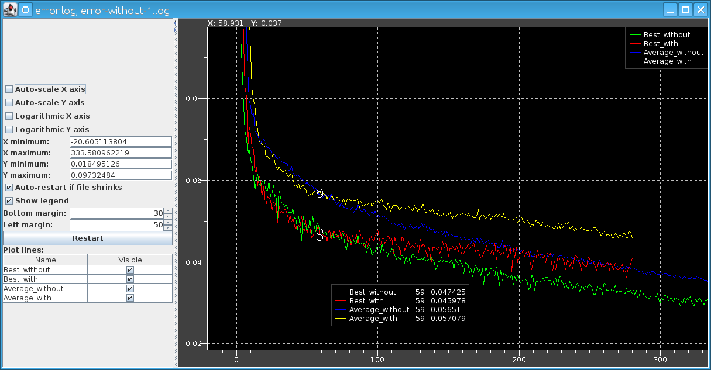

TailPlot
--
Plots a file, displaying new data as it is generated (analogous to 'tail -f')

Building
--
1. Clone [patched version of MCT from GitHub](https://github.com/adamcrume/mct.git)
2. In `mct/Plotter` folder, run `mvn install`
3. In `TailPlot` folder, run `mvn compile assembly:single`
4. Output is `TailPlot/target/tailplot-1.0.0-jar-with-dependencies.jar`

Running
--
Run as `java -Dsun.java2d.opengl=true -jar target/tailplot-1.0.0-jar-with-dependencies.jar`.
Run with `--help` for usage instructions.
